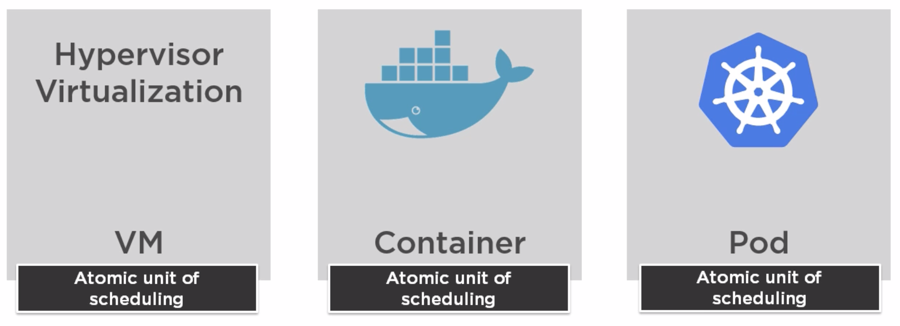
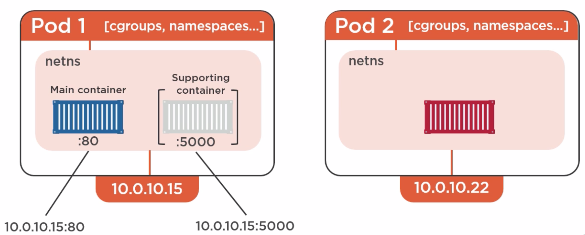
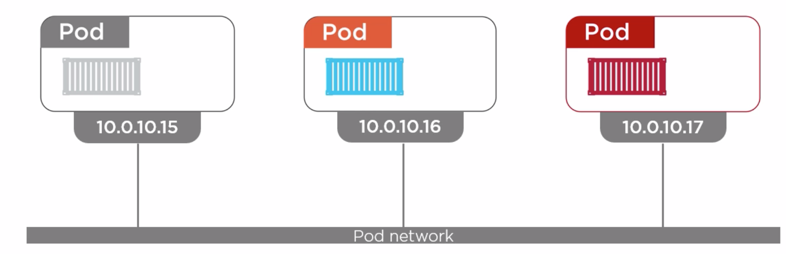
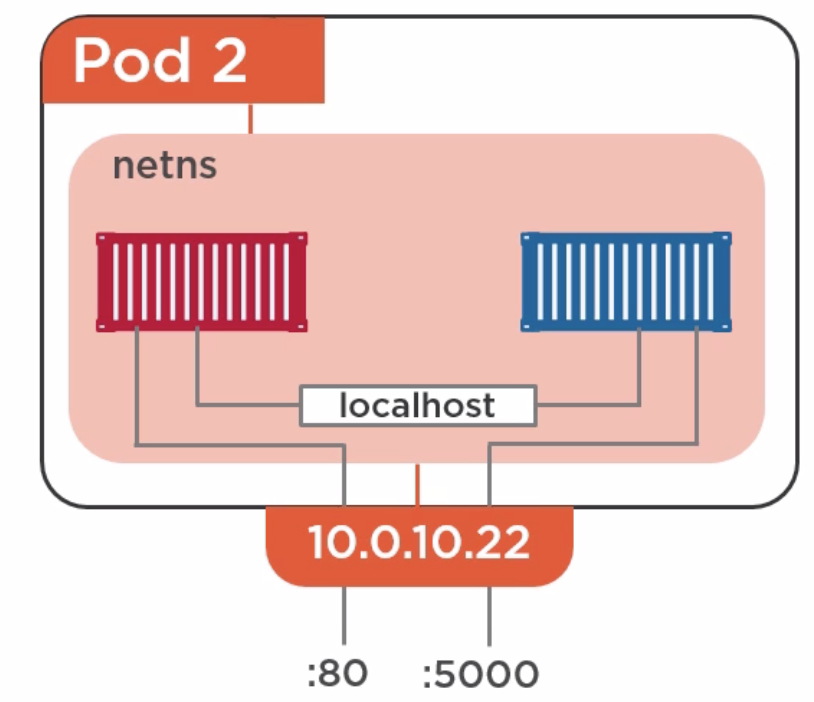
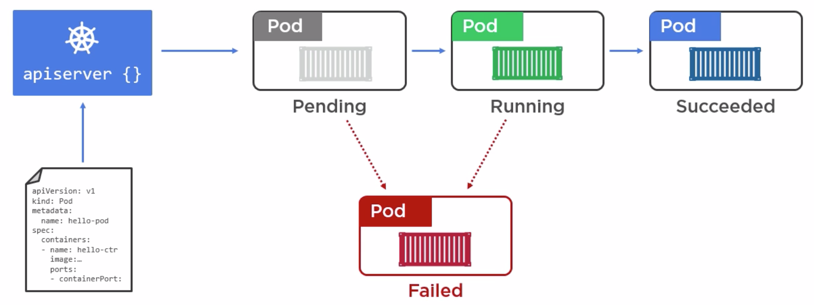
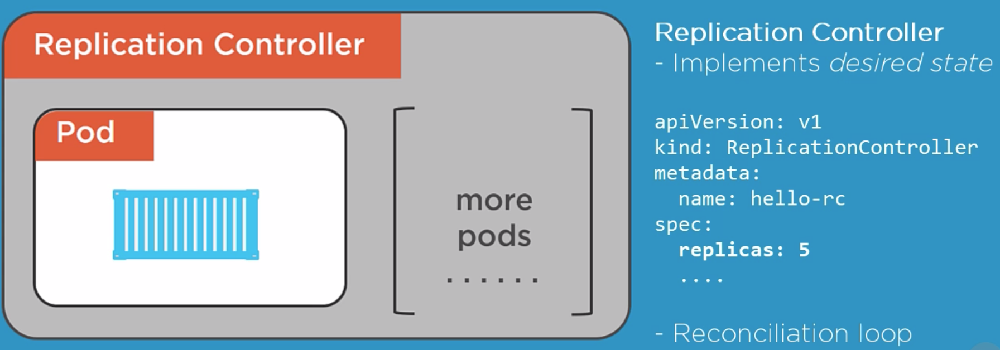

# POD Basics

- A pod can have multiple containers
- Among multiple containers, one will be main and remaining will be supporting containers
- Pod gets single ip

- Inter pod network communication

- Intra pod network communication

- Pod life cycle


# POD Installation
## Create pod using manifest file
```
kubectl create -f pod.yml
```
## Check status of pods
```
kubectl get pods
```
## Check logs of pods
```
kubectl describe pods
```
## Delete pod
```
kubectl delete pods hello-pod
```
# Pod warnings
- We do not play with pod directly
# Replication Controller
 
## To create replication controller
```
kubectl create -f replication-controller.yml
```
## To get the list of replication controller
```
kubectl get rc
```
## To check the details about rc
```
kubectl describe rc
```
## To update config for existing running replication controller
```
kubectl apply -f replication-controller.yml
```